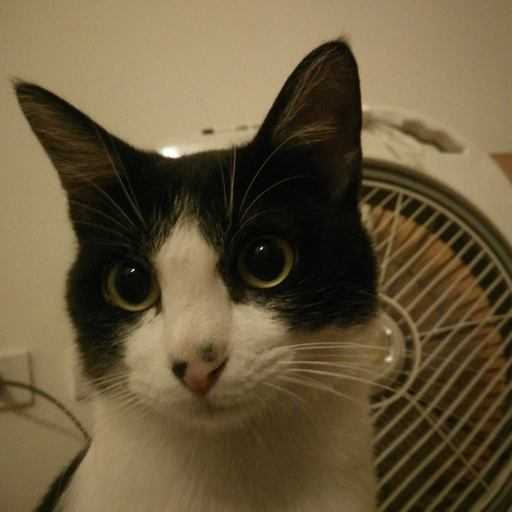

# tom
A simple - no dependency Swift script that chases your mouse on MacOS (works for Monterey)



## What it does?
Move your mouse up then down every 10 seconds.

## Why
At the time of writing this, the great UI automation lib
[PyAutoGUI](https://github.com/asweigart/pyautogui/stargazers) at version
0.9.53 not working on MacOS Monterey (it worked perfectly on Catalina).

Instead of download random software on internet, let just write simple 10 lines
of Swift that is native on MacOS without install anything (I don't know but if
it does, please file an issue).

## Why `tom`
What move a mouse? A cat

Who is the most famous cat on the world? Tom (& Jerry)

## Install
Download `tom` file  and chmod to allow it to run.

```
curl -Lo tom https://raw.githubusercontent.com/hvnsweeting/tom/main/tom.swift && chmod a+x tom
```

## Usage
Open terminal, then type

```
./tom
```

Or

```
swift tom
```

## Test
Tested on Swift 5 on MacOS Monterey 12.4

## Author
- Viet Hung Nguyen
